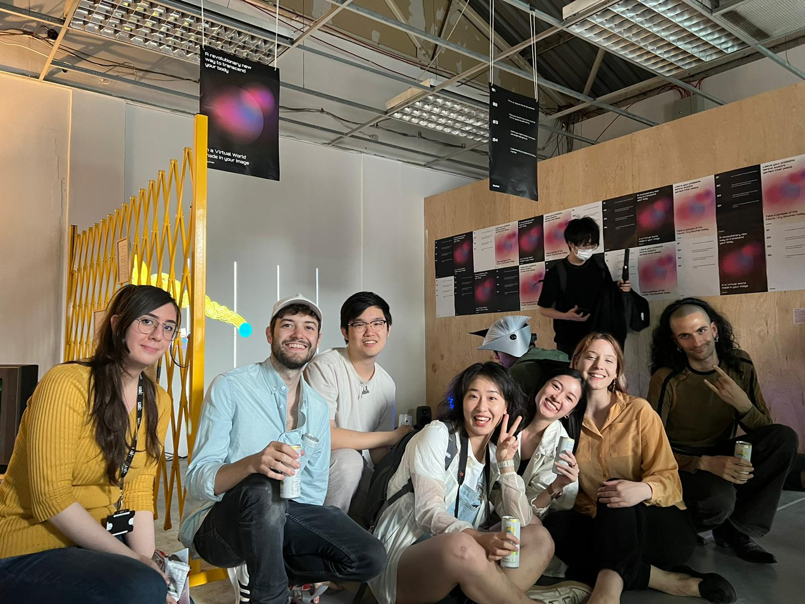

# SoulNet

### Introduction

SoulNet is a critical exploration of the relationships between virtual worlds and freedom. In this experience, the participant's mind is put in a state of flow while their body is in a state of discomfort. 

This interactive installation is staged as a fictional tech demo set in the near future. Participants are beckoned by a voice that offers "a new virtual world made in their image". To enter, users must put on a tethered bio helmet and place both hands in the _SoulScanner™️_ globes which are filled with a wet goo. These hand contact points are set near the ground, requiring players to crouch and twist their arms in awkward ways.

Once the user is "hooked in", their digital avatar appears in the  game and they are able to experience "free flow" in the virtual world by moving their character with their head movements. In the game, users can interact with other players, collect items, grow their trails, and explore freely. If the player ever detaches from the goo, an aggressive voice demands they re-engage. Failing do to so leads to the death of their avatar.

### Ideation
Brainstorming for any project is hard, and doing so with 6 other people can be even harder, but I am quite impressed with our team's process and the resulting work. We developed an iterative process where we would individually add ideas to a Miro board, discuss them in person, reflect, and then add more ideas. You can see this progression from the messy trails of ideas from frame one to the more organized and related notes in frame three. During brainstorming, I helped hone in on the idea of "freedom": in these ads for the metaverse we are promised a new sense of _unlimited freedom_. But free from what? And at what cost?

### Early Focus
When we started splitting up the work in the very first weeks of the semester, I volunteered to work on the flow of information from the arduino through Unreal Enginge, which remained a priority for me throughout the project.

My initial goal was to set up a clear and strict API between the arduino output and Unreal input so that people could work on the electronics and virtual world simultaneously without worrying about breaking the other person's work.

*Flow chart depicting the API and flow of information from Arduino -> Unreal*

I developed a simple prototype of the system which eventually became the base structure of our installation code. The system works as follows:
1. Information is generated by the individual player sensors (gyros, touchpads, etc.)
2. Every 50 milliseconds, we print a JSON string to Serial of the current game state for every player which contains their current state, touch status, and controller position
3. Processing consumes these JSON messages from serial and outputs them in a similar format via OSC
4. Unreal Engine consumes the structured OSC messages and inputs them into the global `GameInstance` object
5. The main loop of the Unreal game consumes the updated values on the GameInstance, updates any relevant internal state and updates the game (including player positions, game sounds, etc.)
   

*Blueprint where OSC messages are consumed and saved in the global GameInstance object*

### Implementation
Once these architectural bits were in place, I began to focus on the game mechanics alongside Alexandre with a specific focus on the smooth camera motions, item spawner and player states.

While there was always more we wanted to do with the game (more sounds! more physics! more interactions!), we felt we reached a point where the game was "usable" and we needed to focus all our attention on the physical build.

I began by helping out with the reading of the gyro signal in the helmet which controls the player's movement in the game. It took some clever engineering to make slight movements of the head lead to smooth motions in the game (aided by Alexandre's well-thought-out physics system in the game). 

*SenstaHelmet containing the gyro sensor*

### From Theory To Practice
At this point, the key bits of the game _worked_, but when we let people who weren't on the team try it out, they had no idea what to do. 

From this point forward, I put much of my attention into building a suitable feedback system for the game and more clear "player states" to lead the player through the experience. The feedback was provided primarily through the use of LEDs in the player stations and worked as follows:
1. Standby: white LEDs pulsate at low levels
    - Awaiting player interaction
2. Pre-Active: bright white light
    - User has engaged with one of the input stations, but is not "fully" hooked in yet
3. Active: Pulsating blue light
    - User has both hands engaged in the station and is active in the game
4. Disengaged: Aggressive red blinking light
    - User has removed a hand from a touch point and will imminently "die" in the game

Building these states allowed for cleaner code on both the arduino side and within the Unreal game. It also allowed for fine-tuned audio and visual feedback in the virtual game to correspond to the physical feedback. These feedback states had a very practical effect of guiding the user from the beginning to the end of the experience. 

### The big show!
The week leading up to the big show involved our team basically converting the laser cutting room into our studio. Between the stations, helmets, and meters of wire, we had quite a lot of fabrication and assembly going on simultaneously. In addition to testing that everything worked, we needed to start thinking about sensible ways of breaking down the system, transporting it, and building it back up. During this week, I was helping with improving the stability of the system, developing the game narrative, and being an extra pair of helping hands for painting, gluing and soldering.

Setting up started smoothly enough, but just a couple hours before the show, we noticed some really poor behavior with our MRP121 touch sensors acting unreliably. We always had a problem with these chips, and perhaps we were overly naive thinking that they would work on opening night, but unfortunately that was not the case. These chips functioning well is essential for the game to work, otherwise the player cant begin gameplay.

So with just an hour before the show, I opened my laptop, sat on the ground and started coding a new solution to add thresholds, timers, and stability to the touch sensors (seen in this [commit](https://github.com/adamdavidcole/unreal-free-float-game/commit/1fa5f1edc5e4aff2a0fe7e707d8f032c8257771f)).

We uploaded the new code to the arduino as people began arriving, crossed our fingers, and hoped for the best. When the lights on the installation turned on and the touch sensors suddenly started working again, I breathed a quick sigh of relief and was able to enjoy the rest of opening night. 

### Conclusion
From my perspective, the exhibition was a great success. People seemed to genuinely enjoy the experience, the system worked reliably (mostly), and there were no massive disasters to mention.

I think there is room to improve the game on two major fronts:
- Technically: while the system works, it did crash about every 3-5 hours requiring a manual restart. We'd like to figure out why the system crashes in the first place as well as develop an easier restart "button"
- Aesthetically: the game is quite fun to play, and in many ways that was the goal, but we also want to put users in a more reflective, critical state. There is more we can do with the meta-narrative around the game, as well as increasing the physicality of the controllers and touch points.

Overall, I'm very proud of the work my team put into this project and I think it shows with the final product. We're excited to take this project forward.

